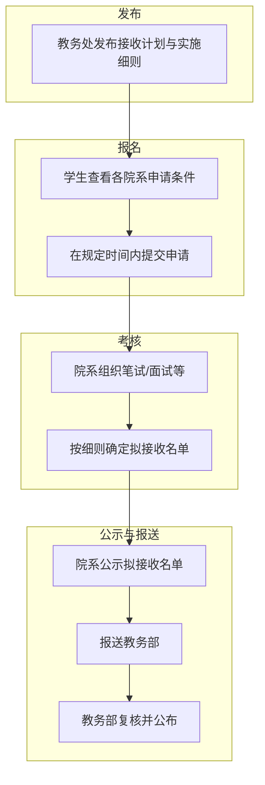
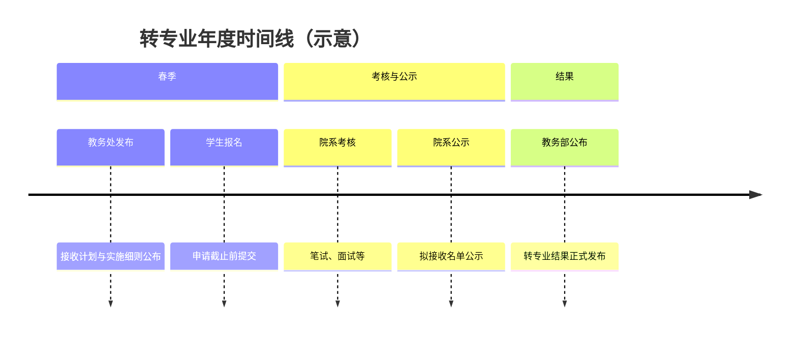

> [!info]
> 以下流程为常规转专业（招生选拔）的通用节点，具体时间与要求以**教务处当年通知**为准。

> [!tip]
> 本页只讲“流程顺序”。具体分数线、课程要求等规则请到 [[政策与细则/政策与细则导航]] 和 [[学院/学院导航]] 查看。

## 流程概览

## 主要节点说明

| 阶段 | 说明 |
|------|------|
| **发布** | 教务处公布当年转专业接收计划与各院系实施细则（含申请条件、考核方式、录取规则、联系人等），通常附 PDF 全文。 |
| **报名** | 学生对照目标院系要求，确认符合条件后，在教务处规定时间内提交转专业申请（具体系统与截止日见当年通知）。 |
| **考核** | 各接收院系按本单位实施细则组织考核（常见为笔试 + 面试，比例与科目各异），按成绩与规则确定**拟接收**学生名单。 |
| **公示** | 院系对拟接收名单进行公示（如 3 个工作日），无异议后报送教务部。 |
| **报送与公布** | 教务部复核名单，经分管校领导审批后，正式公布转专业结果。 |

## 时间线示意

每年具体日期（如报名起止、考核日、公示期）以教务处及院系当年通知为准。可关注教务处官网及 [[经验与社区/中山大学转专业相关群聊]] 获取动态。

## 暑期衔接（降级转入常见问题）

> [!info]
> 转专业结果公布后，到新学期开始前，降级转入同学通常会面临宿舍与行李衔接问题。具体安排以当年通知为准。

### 2024 年可核验样本（行李寄存）

根据《2024级降级转专业本科生行李寄存指引》：

1. 办理时段：`2024-07-07` 至 `2024-07-11`，`8:00-19:30`。
2. 存放地点：广州校区南校园体育馆二楼南门平台。
3. 限制规则：原则上一人不超过 3 件/箱，外箱标注姓名、学号、学院、联系方式。
4. 联系电话：`020-84115617`（徐老师）。

附件： [2024级降级转专业本科生行李寄存指引](../assert/2024级降级转专业本科生行李寄存指引.docx)

## 2025 年可核验节点（样本）

> [!note]
> 下表是已公开、可核验的 2025 年“样本节点”，用于帮助你建立时间感，不是下一年的固定日程。

| 日期 | 来源 | 可核验信息 |
|------|------|------------|
| 2025-04-24 | 教务部通知 | 发布 2025 年转院系专业通知。[[政策与细则/官方信息入口与FAQ]] |
| 2025-05-06 | 软件工程学院通知 | 转专业考核安排发布；报名材料截止 2025-05-19 17:00；笔试时间 2025-05-24 15:00-17:00。 |
| 2025-05-09 | 电子与信息工程学院通知 | 报名材料截止 2025-05-13 16:00；面试时间 2025-05-25 09:00。 |
| 2025-08-17 | 信息管理学院通知 | 发布“信息管理与信息系统二次遴选”宣传样例，并提示以教务系统公告为准。 |

对应链接：

- 教务部（2025 通知）：[https://jwb.sysu.edu.cn/article/4091](https://jwb.sysu.edu.cn/article/4091)
- 软件工程学院：[https://sse.sysu.edu.cn/article/1316](https://sse.sysu.edu.cn/article/1316)
- 电子与信息工程学院：[https://seit.sysu.edu.cn/article/731](https://seit.sysu.edu.cn/article/731)
- 信息管理学院（2025 样例）：[https://ischool.sysu.edu.cn/zh-hans/article/790](https://ischool.sysu.edu.cn/zh-hans/article/790)
- 信息管理学院（2024 二次遴选问答）：[https://ischool.sysu.edu.cn/zh-hans/article/553](https://ischool.sysu.edu.cn/zh-hans/article/553)

> [!note]
> 信息管理学院旧链接 `https://ischool.sysu.edu.cn/news/1542392.htm` 截至 2026-02-26 已无法访问，建议从学院本科教务栏目检索最新通知。

## 相关链接

- [[政策与细则/政策与细则导航]] — 年度政策导航
- [[学院/计算机学院/历年政策/2025接收计划与实施细则]] — 以计算机学院为例的申请与考核细则
