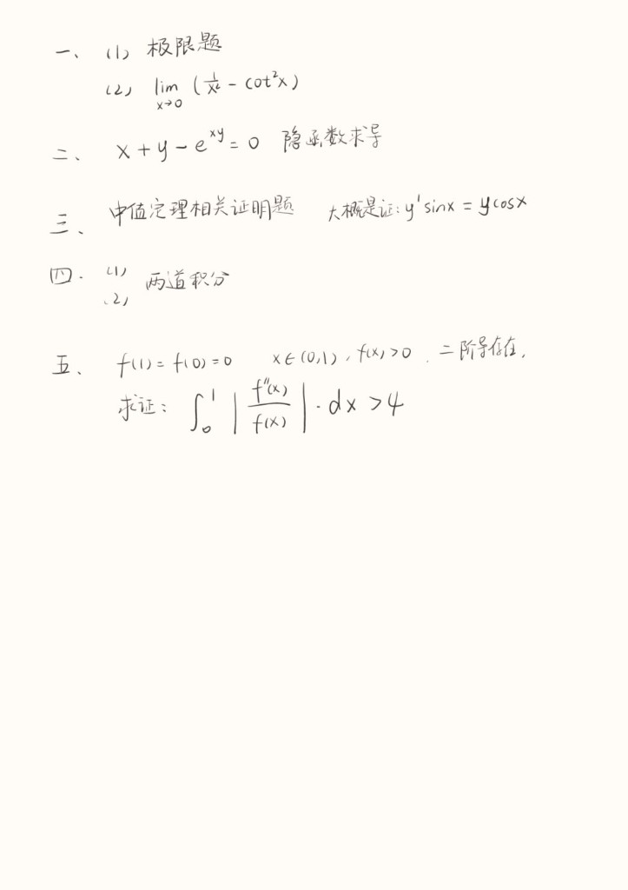

> [!info]
> **2024 年** · 来源：回忆整理。以下为高数笔试部分手写回忆，机试题暂无；若有补充欢迎通过 [[如何参与贡献]] 提交。

### 手写回忆原图

---

## 一、高等数学（整理）

### 1. 极限题

求极限
$$
\lim_{x\to 0} (x - \cot^2 x).
$$

（其中 $\cot^2 x = (\cot x)^2$。）

---

### 2. 隐函数求导

方程
$$
x + y - e^{xy} = 0
$$
确定隐函数，求其导数（隐函数求导）。

---

### 3. 中值定理相关证明题

中值定理相关证明题，大概是证：
$$
y' \sin x = y \cos x
$$
（或与之类似的关系，具体表述以考场回忆为准。）

---

### 4. 积分题

两道积分题（具体式子待补充；若有回忆欢迎贡献）。

---

### 5. 证明题

设 $f(0) = f(1) = 0$，当 $x \in (0, 1)$ 时 $f(x) > 0$，且 $f$ 二阶可导。求证：
$$
\int_0^1 \left| \frac{f''(x)}{f(x)} \right| \, \mathrm{d}x > 4.
$$

---

## 说明

- 机试真题暂无，若有回忆或资料欢迎补充。
- 其他年份：[[学院/计算机学院/历年真题/2022笔试|2022 笔试]]、[[学院/计算机学院/历年真题/2025笔试|2025 笔试]]、[[学院/计算机学院/历年真题/2025机试|2025 机试]]。
- 计院接收计划与考核方式：[[学院/计算机学院/历年政策/2025接收计划与实施细则]]。

以上内容为同学回忆整理，仅供参考；请以教务处及计算机学院当年公布为准。
