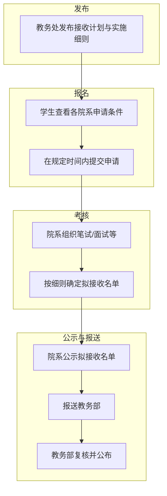
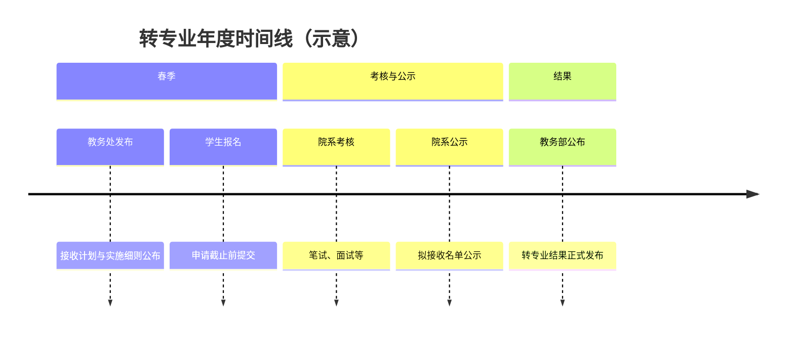

> [!info]
> 以下流程为常规转专业（招生选拔）的通用节点，具体时间与要求以**教务处当年通知**为准。

> [!tip]
> 本页只讲“流程顺序”。具体分数线、课程要求等规则请到 [[政策与细则/政策与细则导航]] 和 [[学院/学院导航]] 查看。

## 流程概览

## 主要节点说明

| 阶段 | 说明 |
|------|------|
| **发布** | 教务处公布当年转专业接收计划与各院系实施细则（含申请条件、考核方式、录取规则、联系人等），通常附 PDF 全文。 |
| **报名** | 学生对照目标院系要求，确认符合条件后，在教务处规定时间内提交转专业申请（具体系统与截止日见当年通知）。 |
| **考核** | 各接收院系按本单位实施细则组织考核（常见为笔试 + 面试，比例与科目各异），按成绩与规则确定**拟接收**学生名单。 |
| **公示** | 院系对拟接收名单进行公示（如 3 个工作日），无异议后报送教务部。 |
| **报送与公布** | 教务部复核名单，经分管校领导审批后，正式公布转专业结果。 |

## 时间线示意

每年具体日期（如报名起止、考核日、公示期）以教务处及院系当年通知为准。可关注教务处官网及 [[中山大学转专业相关群聊]] 获取动态。

## 相关链接

- [[政策与细则/政策与细则导航]] — 年度政策导航
- [[学院/计算机学院/历年政策/2025接收计划与实施细则]] — 以计算机学院为例的申请与考核细则
